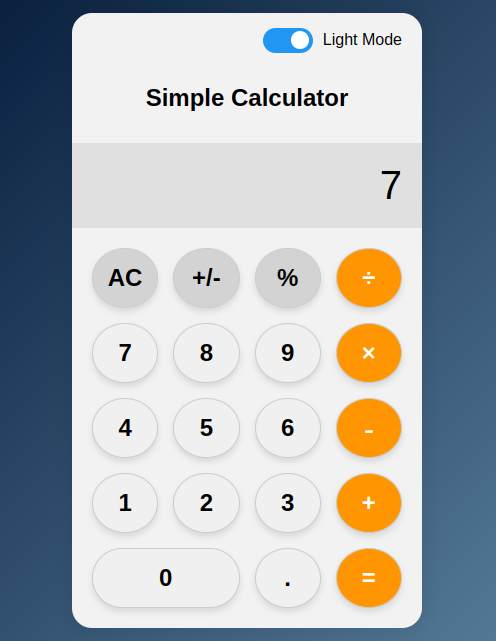
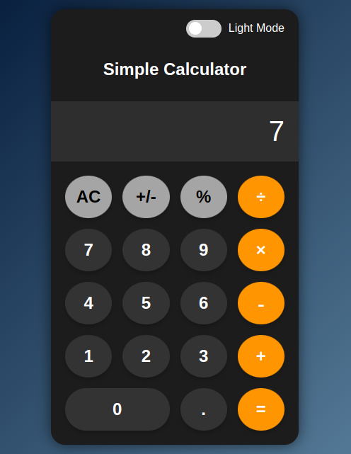

# Simple Web Calculator 🧮

---

## 🚀 Live Demo
Check out the live version of the calculator here: [Live Demo](https://cyril-nii.github.io/web-calculator/)

---

## 📸 Preview

<div align="center">
  
  
</div>

---

## 🛠️ Technologies Used
- **HTML**: For structuring the content.
- **CSS**: For styling and layout design.
- **JavaScript**: For functionality and interactivity.


---

## ⚙️ How to Use
1. Clone the repository:
   ```bash
   git clone https://github.com/Cyril-Nii/web-calculator.git
2. Navigate to the project directory:
   ```bash
   cd web-calculator
4. Open index.html in your browser to use the calculator.


---

## 🤝 Contributing
Contributions and feature requests are welcome! Feel free to fork the repository and submit a pull request.

---

## 📜 License
This project is licensed under the [Unlicense](LICENSE).
